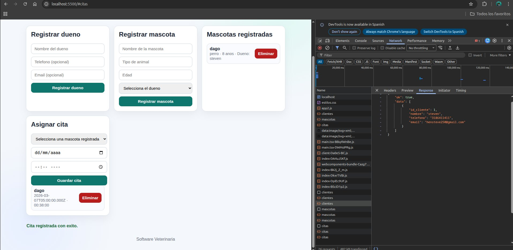
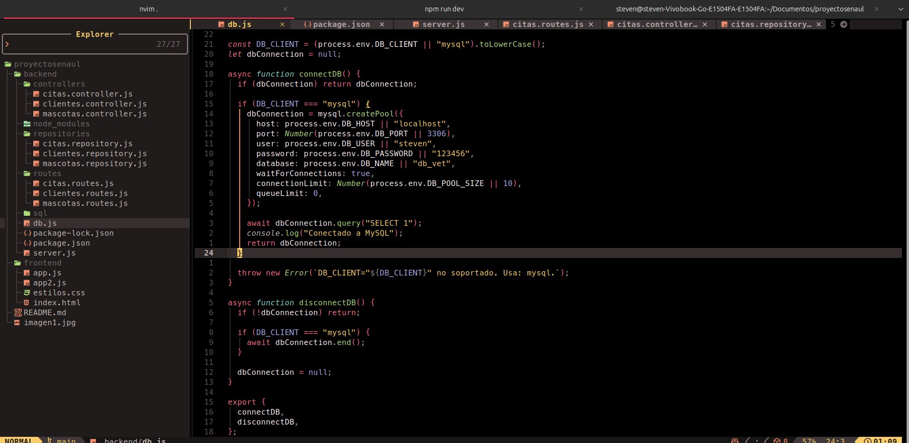
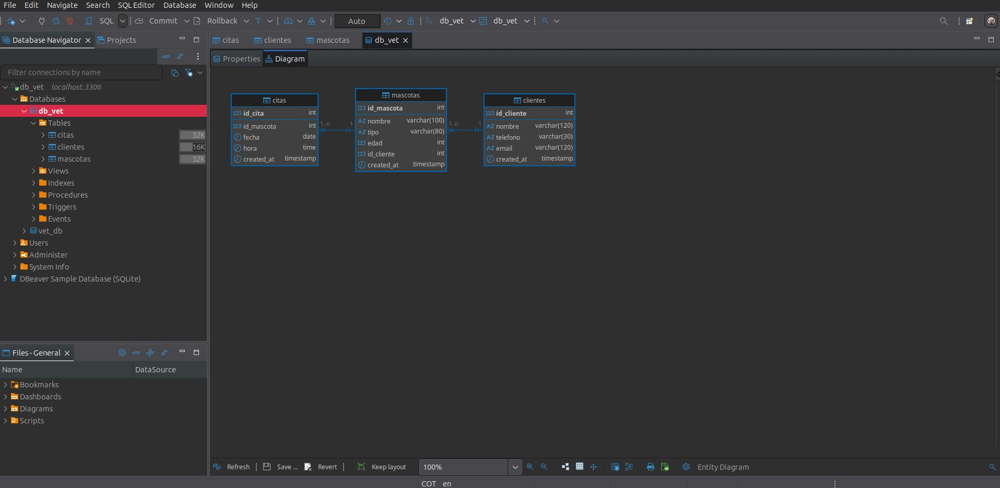
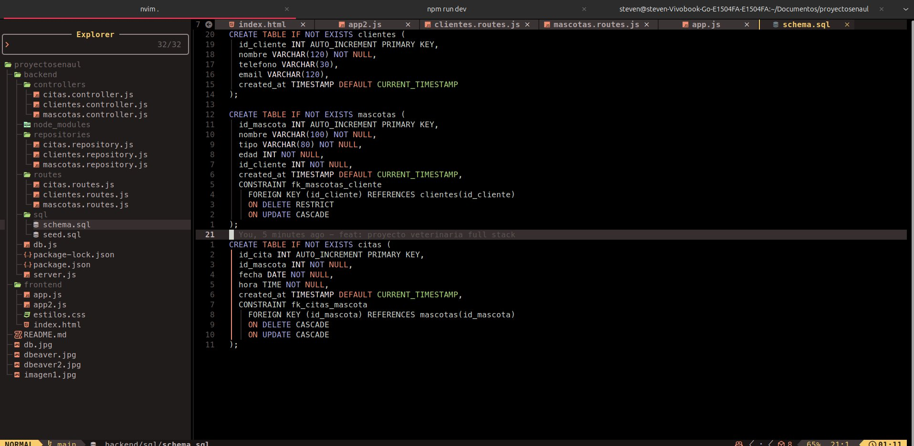
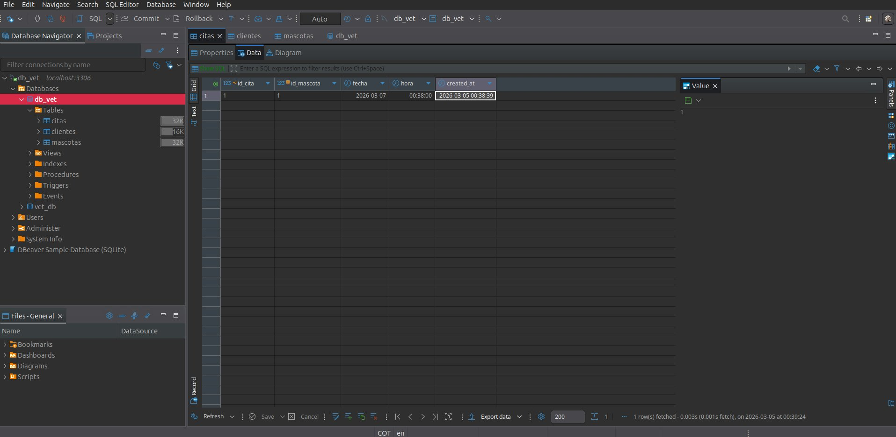

# Proyecto SENA - Sistema de Gestion Veterinaria

Aplicacion full stack orientada al contexto academico SENA para la gestion de clientes (duenos), mascotas y citas veterinarias.

El proyecto permite:
- Registrar duenos de mascotas.
- Registrar mascotas asociadas a un dueno (`id_cliente`).
- Crear y eliminar citas por mascota.
- Visualizar la informacion en una interfaz web simple y funcional.

## Stack Tecnologico

- **Frontend:** HTML5 + CSS3 + Vanilla JavaScript (`frontend/`).
- **Backend:** Node.js + Express (`backend/server.js`).
- **Base de datos:** MySQL 8 (`db_vet`).
- **Cliente SQL visual:** DBeaver (para inspeccionar tablas y datos).

## Arquitectura Aplicada

Se usa una arquitectura por capas para separar responsabilidades:

1. **Routes**
   Define endpoints HTTP y delega la logica.
2. **Controllers**
   Gestiona `req/res`, validaciones y codigos de respuesta.
3. **Repositories**
   Ejecuta consultas SQL crudas (acceso a datos).
4. **DB**
   Conexion centralizada a MySQL mediante pool (`backend/db.js`).

Flujo principal:

`Route -> Controller -> Repository -> MySQL`

Esta estructura facilita mantenimiento, pruebas y escalabilidad frente a un crecimiento del sistema.

## Modelo de Datos

Tablas principales:

- `clientes`
  - `id_cliente` (PK)
  - `nombre`, `telefono`, `email`
- `mascotas`
  - `id_mascota` (PK)
  - `nombre`, `tipo`, `edad`
  - `id_cliente` (FK -> `clientes.id_cliente`)
- `citas`
  - `id_cita` (PK)
  - `id_mascota` (FK -> `mascotas.id_mascota`)
  - `fecha`, `hora`

Relaciones:
- Un cliente puede tener muchas mascotas.
- Una mascota puede tener muchas citas.

## API REST Disponible

Base URL: `http://localhost:3000/api`

- `GET /clientes`
- `POST /clientes`
- `GET /mascotas`
- `GET /mascotas/:id`
- `POST /mascotas`
- `PUT /mascotas/:id`
- `DELETE /mascotas/:id`
- `GET /citas`
- `POST /citas`
- `DELETE /citas/:id`

## CORS y Seguridad Basica en Desarrollo

El backend esta configurado para aceptar peticiones **solo** desde:

- `http://localhost:5500`

Esto evita errores CORS y restringe origenes no autorizados en entorno local.

## Instalacion y Ejecucion

### 1) Backend

```bash
cd backend
npm install
npm run dev
```

### 2) Crear esquema de base de datos (migracion inicial)

```bash
mysql -u steven -p123456 db_vet < backend/sql/schema.sql
```

### 3) Cargar datos de prueba (seed)

```bash
mysql -u steven -p123456 db_vet < backend/sql/seed.sql
```

### 4) Frontend con servidor Python

```bash
cd frontend
python3 -m http.server 5500
```

Abrir en navegador:

- `http://localhost:5500`

## Evidencias del Proyecto

### Evidencia 1 - Interfaz frontend operativa
Vista del sistema web para registrar duenos, mascotas y citas.



### Evidencia 2 - Conexion backend a MySQL
Configuracion y conexion activa desde `db.js` hacia MySQL.



### Evidencia 3 - Visualizacion en DBeaver (tabla citas)
DBeaver se usa como interfaz visual para consultar tablas, datos y revisar el modelo relacional.



### Evidencia 4 - Ejecucion de migracion (schema.sql)
Script de migracion para crear tablas `clientes`, `mascotas` y `citas` con llaves foraneas.



### Evidencia adicional
Vista complementaria de la base en DBeaver.



## Enfoque Academico SENA

Este proyecto refleja buenas practicas para un desarrollo full stack de formacion SENA:

- Separacion por capas (rutas, controladores, repositorios).
- Integracion real con MySQL relacional.
- Consumo de API desde frontend en Vanilla JS.
- Migraciones SQL versionadas (`schema.sql` y `seed.sql`).
- Configuracion CORS controlada para desarrollo local.

## Estado

Proyecto funcional para operaciones CRUD base sobre clientes, mascotas y citas, con interfaz web y persistencia en MySQL.
